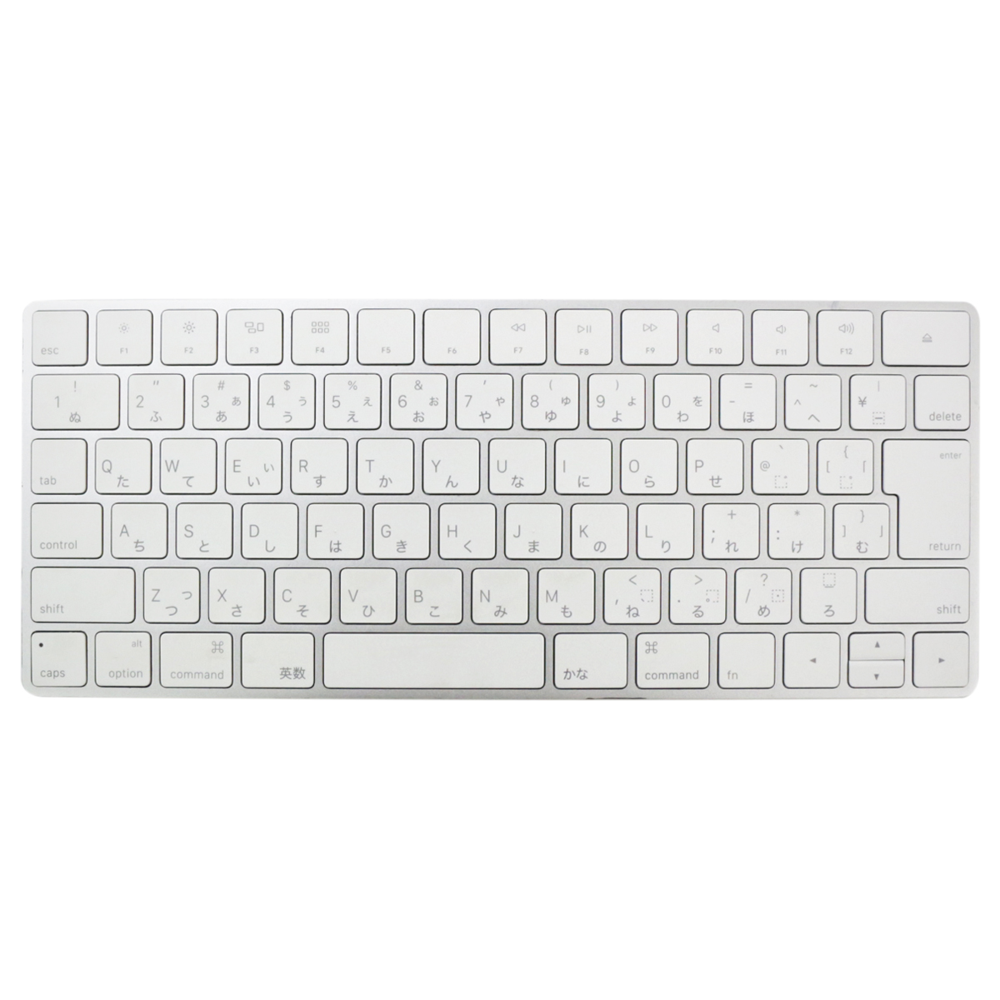
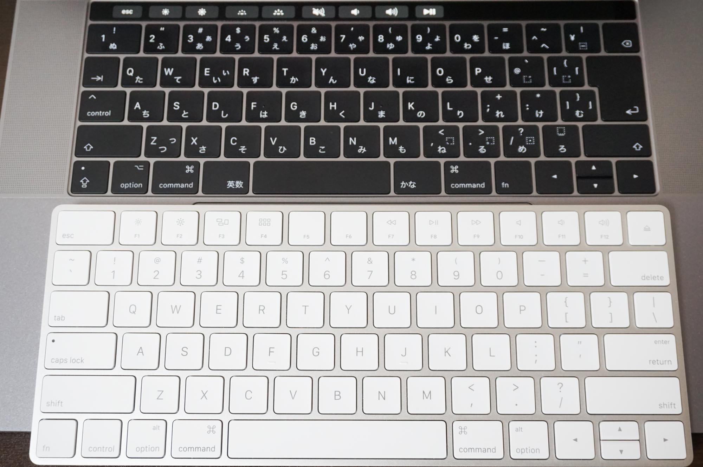
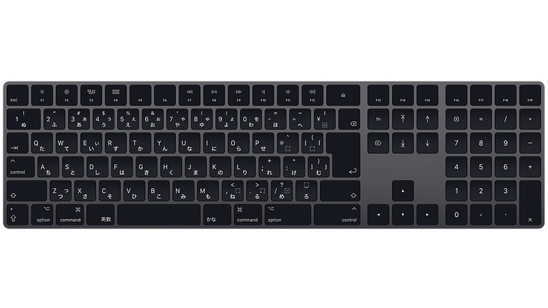
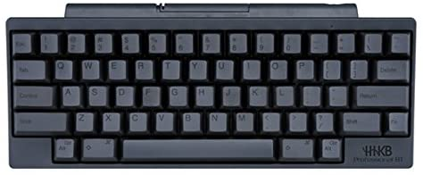

# キーボードをUS配列にしてみた話

---

## 結論

### JIS配列に戻しました

※ US配列が使いにくかったわけはありません  
あくまで私の環境に合わなかっただけ。

---

## US配列にしようと思ったきっかけ

PCをmacに変えた。
キー配列が若干winと違って気持ち悪い

---

---

## じゃあ、全てをUS配列にしてみよう

---

## US配列のメリット

- ホームポジション
- Enterの距離
- 効率的な配置
- （おまけ）見た目がスッキリ

---

---

## JIS配列に戻そうと思ったわけ

- 結局会社のMacBook ProがJIS配列  
  →会議の度にワイヤレスキーボード持参

- 英数入力ーかな入力の変換が地味にしんどい
  →実はキーバインドカスタマイズでなんとかなる
  　→でもwinも使うとなるとどうにもならない
  →会社でほとんどコーディング出来ない・・・・・・

---

## JIS配列に戻すと決意

- 英数入力ーかな入力変換は慣れれば便利
- winにおいては無変換、変換を英数入力、かな入力にバインド
- controlキーは実は世界標準企画はmacの方が正しい  
  →さらにcapslockをcontrolにバインド

### ほぼ全ての問題が解決

#### Enter遠いの嫌だなー  

#### でもまあ、我慢できるレベル

---

---

